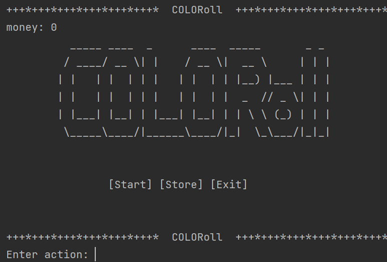
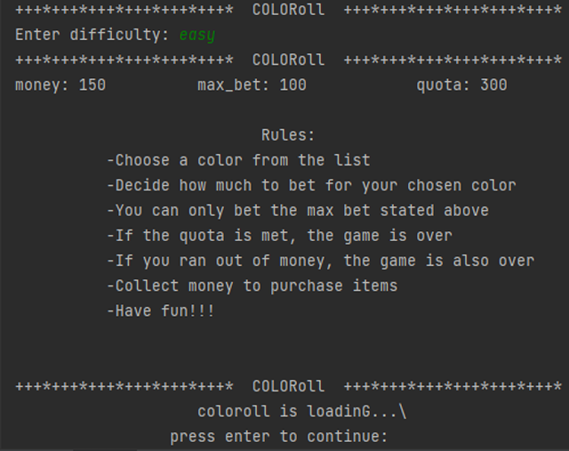
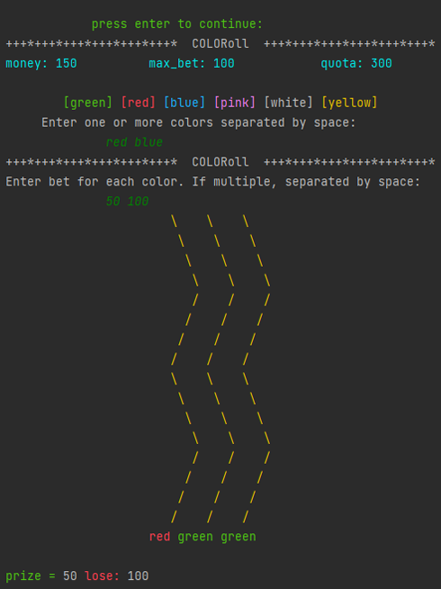

# COLORoll

## Overview
A Python-based betting game using Double-Ended Queue (Deque), inspired by the Color Game from Philippine perya.  

## Features
- Color-Based Betting – Bet on six colors and win based on random results.
- Multiple Modes – Easy, Medium, Hard, Impossible (each with different starting money, max bet, and quota).
- Betting System – Dynamic max bet and validation to prevent invalid inputs.
- Deque-Powered Logic – Uses a deque for bet handling and result comparison.
- Game Store – Buy buffs like Upbet (increase max bet), Manybet (bet on multiple colors), and Coloredbet (enhanced visuals).
- Quota-Based Progression – Reach the quota to win; running out of money ends the game.
- Interactive UI – Color-coded visuals, suspenseful animations, and smooth game flow.

### About the Project  
This project was created during my 2nd year for the Data Structures and Algorithms course. It applies key concepts like deques, dynamic memory handling, and algorithmic decision-making in a game-based scenario.

